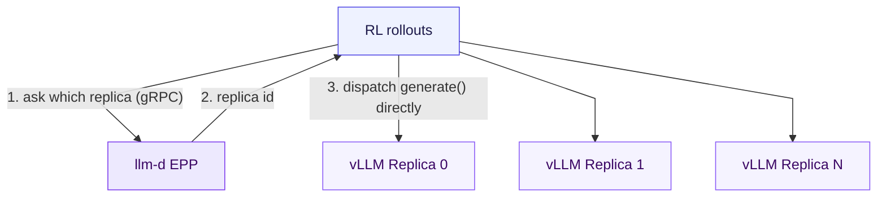
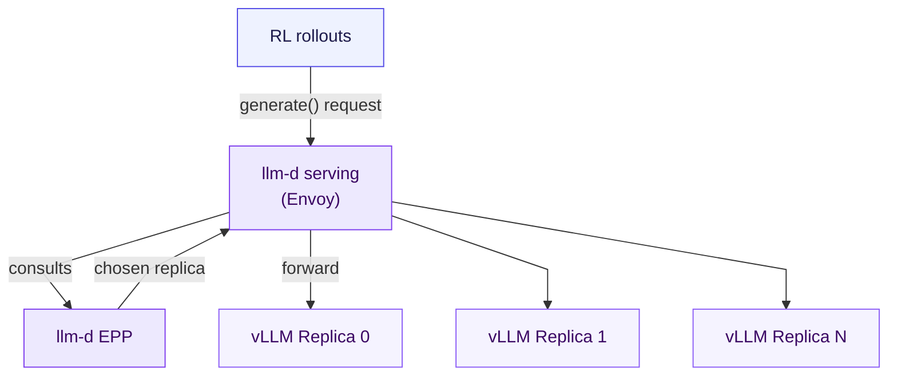

# llm-d-rl

Reinforcement-learning rollout infrastructure for the
[llm-d](https://github.com/llm-d) inference serving stack.

RL post-training frameworks (veRL, OpenRLHF, SkyRL, NeMo-RL, Slime) each need to
route generation requests to a pool of inference engines during training. This
repo integrates llm-d's **Endpoint Picker Plugin (EPP)** into that pool as a
drop-in replacement for round-robin replica selection. EPP scores each candidate
vLLM replica on prefix-cache hit rate, queue depth, and KV utilization, and steers
each request to the replica most likely to already have a warm cache. For
large-group RL workloads (GRPO, PPO with large rollout groups), where many
samples share a prompt prefix, this is a meaningful throughput win over spreading
requests evenly.

```
llm-d-rl/
├── integrations/                 # one directory per framework
│   ├── verl/
│   ├── vime/
│   ├── slime/
│   └── common/                   # library and configs used by the three above
└── quickstart/                   # a full worked example: cluster + provisioning + benchmarks
```

## integrations/

How to integrate llm-d into an RL post-training framework. Supported today:
[verl](integrations/verl/) (the most complete - EPP routing, llm-d serving, PD
and P2P KV-cache sharing), [vime](integrations/vime/) (llm-d routing, vLLM
engines), and [slime](integrations/slime/) (llm-d routing, SGLang engines).
Shared code and configs live in [`common/`](integrations/common/).

There are two integration modes, named by mechanism (EPP is the Endpoint
*Picker* - it scores and selects a replica, it does not proxy):

- **EPP as the endpoint picker** - the framework calls EPP directly over gRPC to
  score replicas, gets back the chosen replica, and dispatches to it itself. Fewer
  moving parts and lower latency; the place to start.
- **llm-d serving** - the framework sends all generation to a single Envoy
  endpoint; Envoy calls EPP to pick the best replica and forwards the request. The
  framework only ever speaks HTTP to one address, closest to a production llm-d
  serving deployment.

Both modes require no framework source changes - they are wired in entirely
through configuration - and both support prefill/decode (PD) disaggregation.

**EPP as the endpoint picker** - the framework asks EPP which replica to use,
then dispatches the rollout there itself:



**llm-d serving** - the framework sends the rollout to a single Envoy
endpoint, which consults EPP and forwards to the chosen replica:



See [`integrations/README.md`](integrations/README.md) and
[`integrations/verl/README.md`](integrations/verl/README.md) for the full setup,
the config overrides for each mode, PD disaggregation, observability, and a
complete end-to-end KubeRay example.

## quickstart/

A full worked example of running the integration on a real cluster: KubeRay
cluster templates, provisioning scripts, and the benchmark harness the routing
results above come from. Nothing here is required to adopt the integration
itself - see [`quickstart/README.md`](quickstart/README.md) for how to run it
and how it is organised.

## Legacy

[`legacy/rl-controller/`](legacy/rl-controller/) is an earlier exploration of a
different architectural direction: a framework-agnostic Go/Python control plane
that owns weight sync, engine lifecycle, and generation routing over plain HTTP,
with no Kubernetes dependency. It has had no active development or users for
several months while work moved to the EPP-based routing above. It is kept for
reference; see [its README](legacy/rl-controller/README.md) for details, but it
is not the recommended starting point for new work.

## License

Apache License 2.0
